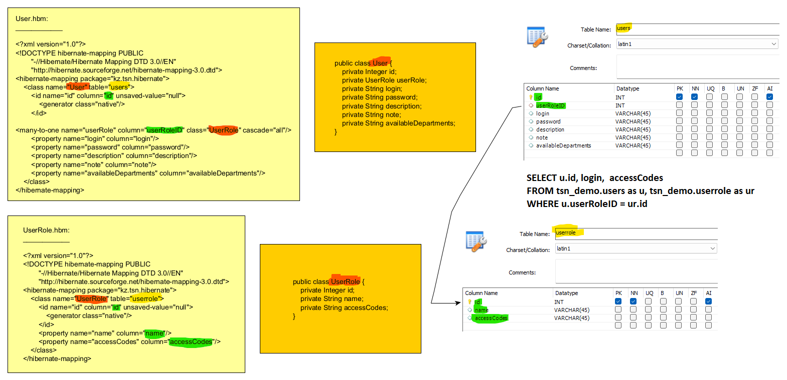

# TSN_JPA_HIBERNATE
Пример использования технологии JPA HIBERNATE в Java для NetBeans


Скрипты для создания таблиц:

```
CREATE DATABASE IF NOT EXISTS `tsn_demo` CHARACTER SET = latin1;

CREATE TABLE IF NOT EXISTS `tsn_demo`.`users` (
  `id` INT(11) NOT NULL AUTO_INCREMENT,
  `userRoleID` INT(11) NULL DEFAULT '0',
  `login` VARCHAR(45) NULL DEFAULT NULL,
  `password` VARCHAR(45) NULL DEFAULT NULL,
  `description` VARCHAR(45) NULL DEFAULT NULL,
  `note` VARCHAR(45) NULL DEFAULT NULL,
  `availableDepartments` VARCHAR(45) NULL DEFAULT NULL,
  PRIMARY KEY (`id`),
  INDEX `FK_5u2kg39886myytwutp0dnxa6d` (`userRoleID` ASC))
ENGINE = InnoDB
AUTO_INCREMENT = 14
DEFAULT CHARACTER SET = latin1;

CREATE TABLE IF NOT EXISTS `tsn_demo`.`userrole` (
  `id` INT(11) NOT NULL AUTO_INCREMENT,
  `name` VARCHAR(45) NULL DEFAULT NULL,
  `accessCodes` VARCHAR(45) NULL DEFAULT NULL,
  PRIMARY KEY (`id`))
ENGINE = InnoDB
AUTO_INCREMENT = 28
DEFAULT CHARACTER SET = latin1
```




https://www.baeldung.com/hibernate-criteria-queries
